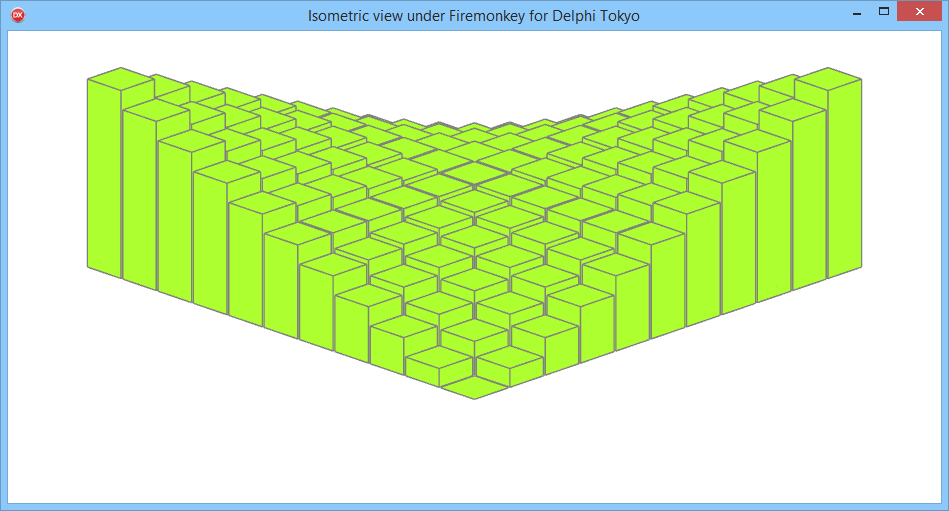

# Isometric view under Firemonkey

Firemonkey do not provide Isometric projection, but if you set the ContextState to cs2DScene, you can override the projection matrix with the "RenderToMatrix" matrix !

