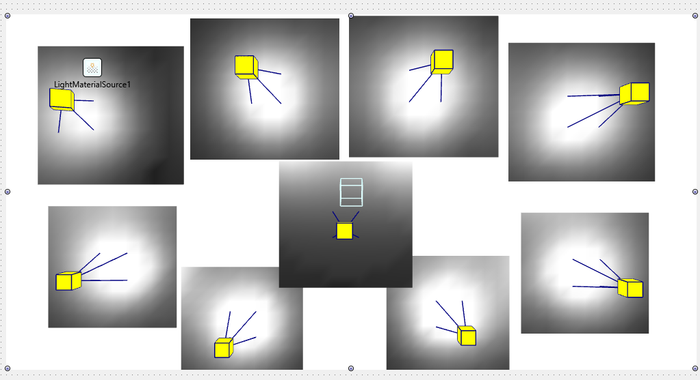
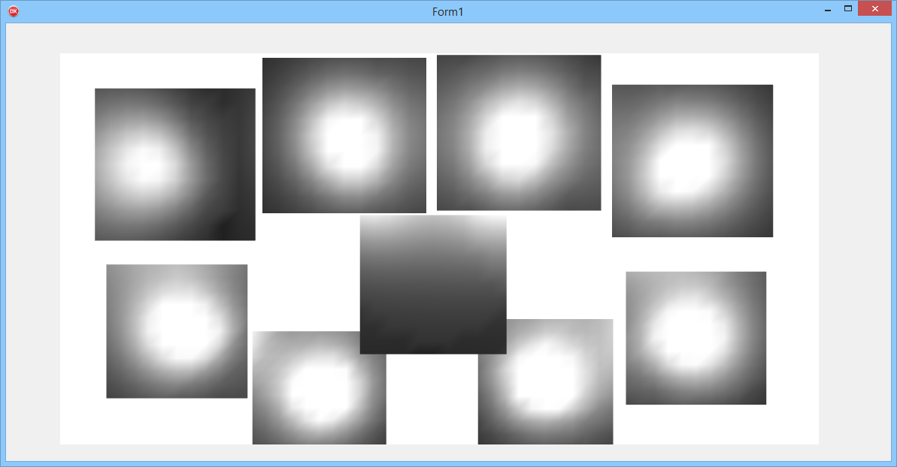
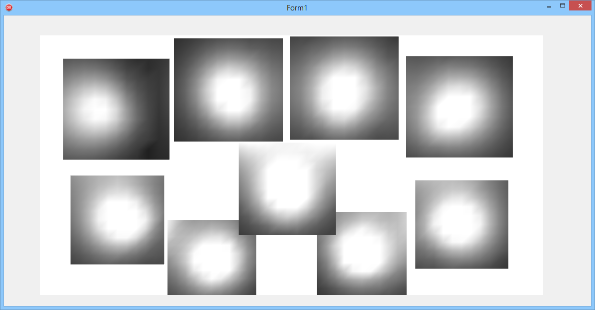

## FMX Lights

There's an hard coded limit of 8 simultaneous lights on a FMX Scene

this demo shows a dirty hack to overflow this limitation.

9 planes with 9 lights in the IDE

without the hack 

 
with the hack

French explanations on Youtube

