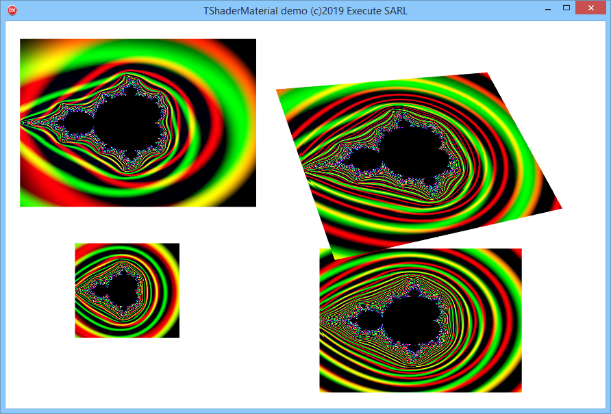

# SourceShader

Sample FMX component to use a Shader as a MaterialSource

you can use directly either a HLSL (DirectX under Windows) or GLSL (OpenGL on other platforms) source code.
```
  const
    PIXEL_SHADER =
  {$IFDEF MSWINDOWS}
      ' float4 main() : COLOR {'
    + '  return float4(1.0, 0.5, 0.5, 1.0);'
    + '}';
  {$ELSE}
      'void main() {'+
      '  gl_FragColor = vec4(1.0, 0.5, 0.5, 1.0);'+
      '}';
  {$ENDIF}
```
