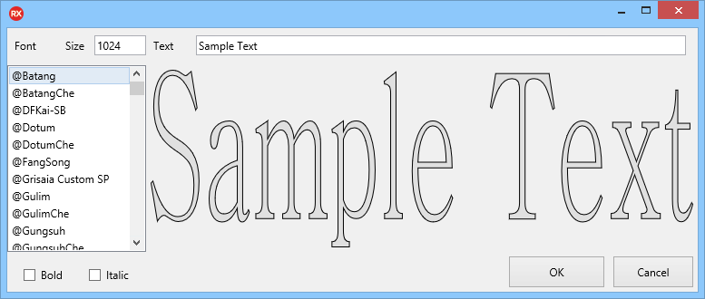
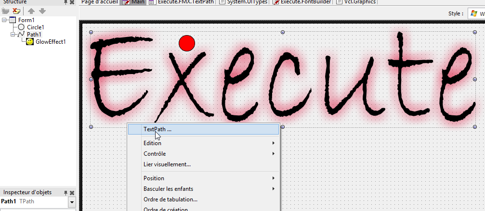

# TextPath

Execute.FMX.TextPathDesigner is a Delphi package that add a "Text Path..." popup option to the FMX TPath component.

This let you create a vectorial text for any plateform from the Windows True Type Fonts.

Fill free to add FMX Effects :)

