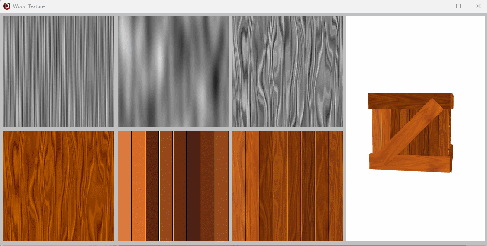

# Wood Texture

This is a Delphi FMX version of my [FlashPascal](https://github.com/tothpaul/FlashPascal) Wood demo

The purpose is to create a procedural texture that looks like wood planks

the Wood.FlashLike implements some of the ActionScript BitmapData functions used on the original demo

 
